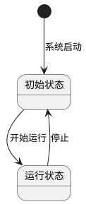
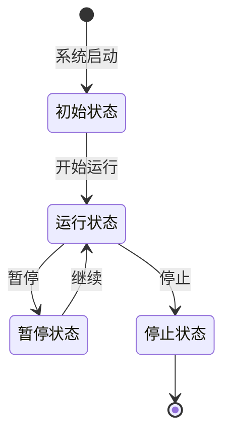

# docs — 详细文档

> 极简快速入门见 [README.md](README.md)。

## 项目特点

- **双工作流兼容**：一套源码，同时支持 LaTeX 编译预览和 Pandoc 转换，使用 LaTeX 编写并预览排版效果 -> 使用 Pandoc 一键生成符合学校格式要求的 Word 文档 -> 在 Word 中微调并提交
- **格式规范**：遵循自己学校的《撰写格式及要求》，旨在使用tex遵守排版规则同时提供word初稿，自动搞定图片表格排版，避免插入内容导致的格式变更
- **自动化处理**：包含自动化脚本处理表格格式、交叉引用、图片大小等
- **自动参考文献管理**：支持 BibTeX 文件，自动生成参考文献列表，Word 中自动添加序列号 [1], [2], [3]...
- **无缝引用转换**：LaTeX 中的 `\cite{key}` 自动转换为 Word 中的上标引用 [1]，无需手动处理
- **PlantUML / Mermaid 支持**：支持 PlantUML 和 Mermaid 纯文本绘图，自动编译为 PNG 图片

## 限制

- **仅支持本校排版，如果你和我学校不同，需要自己微调`ref.docx`的样式依赖，可能还需要修改下`out.ps1`，latex排版部分全部需要修复，可以压榨ai写，这个部分仅供预览**
- **只有正文部分**
- **目录功能有bug**
- **公式字体需要自己勘误**
- **不支持复杂宏包，推荐编译为位图或者矢量图人工插入**

## 项目结构

```
├── main.tex              # 主文档入口
├── preamble.tex          # 样式定义（字体、标题、图表编号等）
├── 00.abstract.tex       # 中文摘要
├── 01.abstract_en.tex    # 英文摘要
├── 02.introduce.tex      # 第1章 绪论
├── 03.sys_env.tex        # 第2章 系统环境
├── 04.require.tex        # 第3章 需求分析
├── 05.systematic_design.tex # 第4章 系统设计
├── 06.feature.tex        # 第5章 功能实现
├── 07.unit_test.tex      # 第6章 系统测试
├── 97.solution.tex       # 解决方案
├── 98.thanks.tex         # 致谢
├── 99.bibl.tex           # 参考文献（自动生成）
├── figures/              # 图片
│   ├── architecture.jpg
│   ├── er_diagram.jpg
│   ├── puml/             # PlantUML 源文件 + 编译输出
│   │   ├── fsm.puml
│   │   └── fsm.svg
│   └── mermaid/          # Mermaid 源文件 + 编译输出
│       ├── fsm.mmd
│       └── fsm.svg
├── bibl/                 # 参考文献
│   ├── fake_ref.bib
│   └── gb7714-2015-numeric.csl
├── bin/
│   ├── plantuml-1.2024.6.jar
│   └── mermaid/
│       └── package.json
├── convert_mermaid.py         # Mermaid 编译工具
├── ref.docx              # Word 样式模板
├── out.ps1               # 一键转换脚本
├── convert_plantuml.py   # PlantUML 编译工具
├── autoexec.py           # 表格自动调整
├── patch_table_caption.py # 表格标题加粗
├── patch_figure_caption.py # 图片标题加粗
├── patch_thanks.py       # 致谢格式修复
├── patch_bibliography.py # 参考文献格式修复
├── gen_bibl.py           # 自动生成参考文献
├── remove_refs.py        # 移除 citeproc 生成的重复参考文献
├── docs.md               # 详细文档（本文档）
├── README.md             # 快速入门
└── .gitignore
```

## 快速开始

### 1. 环境准备

#### LaTeX 环境

- 安装 [TeX Live](https://www.tug.org/texlive/) 或 [MiKTeX](https://miktex.org/)
- 确保包含 XeLaTeX 引擎和中文支持包

#### Pandoc 环境

- 安装 [Pandoc](https://pandoc.org/installing.html)
- 安装 Pandoc 过滤器（PyPI包）：`pandoc-crossref`

  ```bash
  pip install pandoc-crossref
  ```

#### Python 环境（可选，用于表格处理）

- 安装 Python 3.x
- 安装依赖：`pip install pywin32`

#### Java 环境（可选，用于 PlantUML）

- 安装 [Java](https://www.java.com/download/) 或 [OpenJDK](https://openjdk.org/)
- `bin/plantuml-1.2024.6.jar` 已内置，无需额外下载

#### Node.js 环境（可选，用于 Mermaid）

- 安装 [Node.js](https://nodejs.org/)
- 安装 Mermaid CLI（本地安装至 `bin/mermaid/`）：

  ```bash
  cd bin/mermaid && npm install
  ```

### 2. 编译 PDF（LaTeX 工作流）

```bash
# 使用 XeLaTeX 编译
xelatex main.tex

# 如果需要生成交叉引用，需要编译两次
xelatex main.tex
xelatex main.tex
```

### 3. 转换 Word（Pandoc 工作流）

> **注意**：需要执行权限

```bash
# 使用 PowerShell 脚本（推荐）
.\out.ps1
```

### 4. 表格自动调整（Word 文档）

转换后的 Word 文档中的表格可能需要调整：

```bash
# 使用 Python 脚本自动调整表格
python autoexec.py output.docx
```

### 5. 标题加粗处理

```bash
# 表格标题加粗
python patch_table_caption.py output.docx

# 图片标题加粗
python patch_figure_caption.py output.docx
```

### 6. 参考文献管理

系统支持 BibTeX 文件管理参考文献：

1. **添加参考文献**：在 `bibl/fake_ref.bib` 中添加 BibTeX 条目
2. **引用文献**：在 LaTeX 中使用 `\cite{key}` 引用
3. **自动生成**：运行 `.\out.ps1` 时会自动：
   - 扫描所有 `.tex` 文件中的引用
   - 从 `bibl/fake_ref.bib` 提取被引用的条目
   - 生成 `99.bibl.tex` 文件
   - 在 Word 中自动添加序列号 [1], [2], [3]...
4. **格式修复**：自动修复参考文献格式（黑体标题、宋体内容、去缩进、分页）

### 7. 致谢处理

系统自动修复致谢格式：
- 将"致谢"或"致 谢"改为"致    谢"（中间4个空格）
- 设置字体：黑体（SimHei）
- 设置字号：小二（18pt）
- 设置对齐：居中
- 去掉首行缩进
- 添加分页（独立一页）

### 8. PlantUML 绘图

项目支持使用 [PlantUML](https://plantuml.com/) 通过纯文本脚本绘制 UML 图，自动编译为 PNG 图片。

#### 编写 puml 文件

在 `figures/puml/` 目录下创建 `.puml` 文件，例如 `fsm.puml`：



#### 编译

```bash
# 编译所有 puml 文件
python convert_plantuml.py

# 监听模式：文件有变动时自动编译
python convert_plantuml.py --watch

# 编译单个文件
python convert_plantuml.py --file figures/puml/fsm.puml
```

编译后会在同目录生成 SVG 图片（如 `fsm.svg`），可直接在 `.tex` 中引用：

```latex
\begin{figure}[H]
    \centering
    \includegraphics[width=0.7\textwidth]{figures/puml/fsm.svg}
    \caption{PlantUML 状态机示例}
    \label{fig:fsm_example}
\end{figure}
```

> `out.ps1` 在转换 Word 前会自动运行 `convert_plantuml.py` 编译所有 puml 文件，无需手动操作。

#### 支持的 UML 图类型

PlantUML 支持多种 UML 图：时序图、用例图、类图、活动图、状态图、组件图、部署图等。详见 [PlantUML 官方文档](https://plantuml.com/zh/)。

### 9. Mermaid 绘图

项目支持使用 [Mermaid](https://mermaid.js.org/) 通过纯文本脚本绘制流程图、状态图、时序图、甘特图等，自动编译为 PNG 图片（Word 兼容性：Mermaid SVG 使用 foreignObject 渲染文本，Word 无法识别，故默认输出 PNG）。

> **首次使用前**：需要安装 Node.js 依赖（仅需执行一次）：
> ```bash
> cd bin/mermaid && npm install
> ```
> `convert_mermaid.py` 会优先使用本地 `bin/mermaid/node_modules/.bin/mmdc`，无需全局安装。

#### 编写 mmd 文件

在 `figures/mermaid/` 目录下创建 `.mmd` 文件，例如 `fsm.mmd`：



#### 编译

```bash
# 编译所有 mmd 文件（默认输出 PNG）
python convert_mermaid.py

# 输出为 SVG 格式（仅供浏览器预览，Word 嵌入会丢失文本）
python convert_mermaid.py --format svg

# 监听模式：文件有变动时自动编译
python convert_mermaid.py --watch

# 编译单个文件
python convert_mermaid.py --file figures/mermaid/fsm.mmd

# 如果 mmd 文件是 GBK 编码（如 Windows 记事本保存的）
python convert_mermaid.py --charset GBK

# 检查所有 mmd 文件的编码
python convert_mermaid.py --check-encoding
```

#### 主题

Mermaid 内置 5 个主题，通过 `--theme` 切换：

| 主题 | 效果 | 适用场景 |
|------|------|----------|
| `default` | 白底蓝灰调 | 通用（默认） |
| `dark` | 深色背景 | 演示/暗色模式 |
| `neutral` | 中性灰调，比 default 更素 | 论文（推荐） |
| `forest` | 绿色系 | 柔和风格 |
| `base` | 纯白底黑线，最干净 | 黑白打印/论文 |

```bash
python convert_mermaid.py --theme neutral
python convert_mermaid.py --theme base
```

编译后会在同目录生成 PNG 图片（默认），可直接在 `.tex` 中引用：

```latex
\begin{figure}[H]
    \centering
    \includegraphics[width=0.7\textwidth]{figures/mermaid/fsm.png}
    \caption{Mermaid 状态机示例}
    \label{fig:mermaid_fsm}
\end{figure}
```

> `out.ps1` 在转换 Word 前会自动运行 `convert_mermaid.py` 编译所有 mmd 文件，无需手动操作。

#### 支持图类型

Mermaid 支持多种图：流程图（flowchart）、时序图（sequenceDiagram）、状态图（stateDiagram）、类图（classDiagram）、甘特图（gantt）、饼图（pie）、实体关系图（erDiagram）等。详见 [Mermaid 官方文档](https://mermaid.js.org/syntax/)。

#### 编码问题

如果终端或源文件使用 GBK 编码（常见于简体中文 Windows），可能遇到乱码或编译失败：

1. **终端乱码**：脚本会自动检测并适配，也可手动设置环境变量：
   ```bash
   set PYTHONIOENCODING=utf-8
   ```
2. **源文件编码**：先用 `--check-encoding` 检查，再用 `--charset GBK` 编译：
   ```bash
   python convert_mermaid.py --check-encoding
   python convert_mermaid.py --charset GBK
   ```
3. **推荐做法**：在 VSCode 中将 `.mmd` 文件保存为 UTF-8 without BOM，可避免绝大多数编码问题。

### 10. sciplot 科研图表

项目内置了 `sciplot` 科研绘图工具包（基于 matplotlib），支持快速生成热力图、柱状图、折线图、散点图、雷达图、函数曲线、维恩图等常用科研图表，自动编译为 SVG 矢量图。

#### 编写绘图脚本

在 `figures/sciplot/` 目录下创建 `.py` 绘图脚本，例如 `03_heatmap_example.py`：

```python
import numpy as np
import sciplot as sp

# 相关性热力图
np.random.seed(42)
n_vars = 6
corr = np.zeros((n_vars, n_vars))
for i in range(n_vars):
    for j in range(n_vars):
        corr[i, j] = np.tanh((np.random.randn() * 0.3) + 0.5 * (i == j))

var_labels = ["特征1", "特征2", "特征3", "特征4", "特征5", "特征6"]
sp.heatmap(corr, xticklabels=var_labels, yticklabels=var_labels,
           title="特征相关性热力图", cmap="RdBu_r", vmin=-1, vmax=1, mask_upper=True)
sp.savefig("heatmap_correlation")
```

#### 编译

```bash
# 编译所有脚本（默认输出 SVG）
python convert_sciplot.py

# 输出为 PNG 格式
python convert_sciplot.py --format png

# 编译单个文件
python convert_sciplot.py --file figures/sciplot/03_heatmap_example.py

# 监听模式：有变动时自动编译
python convert_sciplot.py --watch
```

#### 支持的图表类型

`sciplot` 提供以下图表 API：

| 函数 | 图表类型 | 示例文件 |
|------|----------|----------|
| `sp.bar()` | 柱状图（单组/分组/堆叠） | `01_bar_example.py` |
| `sp.line()` | 折线图（单线/多线/置信区间） | `02_line_example.py` |
| `sp.heatmap()` | 热力图 | `03_heatmap_example.py` |
| `sp.confusion_matrix()` | 混淆矩阵 | `03_heatmap_example.py` |
| `sp.curve()` | 函数曲线 | `04_curve_example.py` |
| `sp.venn()` | 维恩图（2/3 组） | `05_venn_example.py` |
| `sp.scatter()` | 散点图（含拟合线） | `06_scatter_example.py` |
| `sp.boxplot()` | 箱线图 | `07_boxplot_example.py` |
| `sp.flow()` | 流程图 | `08_flow_example.py` |
| `sp.radar()` | 雷达图 | `09_radar_pie_example.py` |
| `sp.pie()` | 饼图 | `09_radar_pie_example.py` |
| `sp.timeline()` | 时间线图 | `10_timeline_tree_example.py` |
| `sp.tree()` | 树形图 | `10_timeline_tree_example.py` |

编译生成 SVG 图片后，可通过 `\includegraphics` 插入文档（参见第 1 章示例）。

### 11. 完整转换流程

```bash
# 1. 编译 LaTeX 预览
xelatex main.tex

# 2. 转换 Word（包含所有自动处理）
.\out.ps1

# 输出文件：out.docx
# 包含：PlantUML/Mermaid/sciplot 编译、表格自动调整、图片标题加粗、致谢修复、参考文献自动生成和格式化
```

## 格式规范

### 页面设置

- **纸张大小**：A4
- **页边距**：上 2.2cm，下 2.2cm，左 2.5cm，右 2.5cm
- **页眉高度**：1.2cm
- **页脚高度**：1.5cm

### 字体规范

- **中文字体**：宋体（正文）、黑体（标题）
- **英文字体**：Times New Roman
- **正文字号**：小四号（12pt）
- **行距**：1.5 倍行距

### 标题格式

- **一级标题**：小二号黑体，加粗，居中，新页开始
- **二级标题**：小三号黑体，加粗，左对齐
- **三级标题**：四号黑体，加粗，左对齐

### 图表格式

- **图片标题**：五号宋体加粗，位于图片下方
- **表格标题**：五号宋体加粗，位于表格上方
- **推荐使用三线表**

## 交叉引用规范

### 标签命名约定

| 元素类型 | 推荐 `\label` 写法 | 推荐 `\ref` 写法 |
|---------|-------------------|-----------------|
| 图片 (Figure) | `\label{fig:label}` | `\ref{fig:label}` |
| 表格 (Table) | `\label{tbl:label}` | `\ref{tbl:label}` |
| 公式 (Equation) | `\label{eq:label}` | `\ref{eq:label}` |
| 章节 (Section) | `\label{sec:label}` | `\ref{sec:label}` |

### Pandoc 引用格式

对于 Pandoc 转换，推荐使用以下格式：

- 图片引用：`[@fig:label]`
- 表格引用：`[@tbl:label]`

## 使用示例

### 插入图片

```latex
\begin{figure}[H]
    \centering
    \includegraphics[width=0.8\textwidth]{figures/architecture.jpg}
    \caption{系统总体架构}
    \label{fig:architecture}
\end{figure}
```

### 插入表格

```latex
\begin{table}[H]
    \centering
    \caption{登录功能测试用例}
    \label{tbl:login_test}
    \begin{tabular}{cccl}
        \toprule
        用例编号 & 输入数据 & 预期结果 & 实际结果 \\
        \midrule
        TC01 & 正确用户名密码 & 登录成功 & 通过 \\
        TC02 & 错误密码 & 提示错误 & 通过 \\
        \bottomrule
    \end{tabular}
\end{table}
```

### 引用示例

```latex
系统总体架构如图\ref{fig:architecture}所示。
测试用例及结果见表\ref{tbl:login_test}。
```

## 常见问题

### 1. 表格在 Word 中不居中

- 确保表格使用 `\centering` 命令
- 推荐使用 `c`（居中）列格式，如 `\begin{tabular}{ccc}`
- 转换后可使用 `autoexec.py` 自动调整表格

### 2. 交叉引用在 Word 中不显示

- 确保使用正确的标签前缀（`fig:`、`tbl:`、`eq:`、`sec:`）
- 使用 Pandoc 过滤器 `pandoc-crossref`
- 检查 Pandoc 转换命令中的引用配置

### 3. 中文字体问题

- 确保使用 XeLaTeX 编译
- 检查 `preamble.tex` 中的字体设置
- 对于 Pandoc 转换，需要在 Word 模板中设置中文字体

### 4. 页眉页脚设置

- LaTeX 中的页眉页脚在 `preamble.tex` 中定义
- Word 转换后需要在 Word 中手动设置页眉页脚格式

### 5. 参考文献重复或没有序列号

- **问题**：Word 中参考文献重复显示，或没有序列号 [1], [2], [3]...
- **解决方案**：
  1. 确保 `remove_refs.py` 正常工作（移除 citeproc 生成的参考文献列表）
  2. 确保 `patch_bibliography.py` 正常工作（添加序列号）
  3. 检查 `gen_bibl.py` 是否生成正确的 `99.bibl.tex`
  4. 运行 `.\out.ps1` 查看调试信息

### 6. 致谢格式不正确

- **问题**：致谢标题格式不正确，没有居中、分页等
- **解决方案**：
  1. 确保 `patch_thanks.py` 正常工作
  2. 检查致谢段落文本是否为"致谢"或"致 谢"
  3. 运行 `.\out.ps1` 查看是否找到并修改了致谢段落

### 7. 引用显示为问号或重复

- **问题**：LaTeX 编译时引用显示为问号 [?]，或 Word 中引用重复
- **解决方案**：
  1. 确保 `gen_bibl.py` 生成正确的 `99.bibl.tex`
  2. 运行 `xelatex main.tex` 两次以生成正确的引用
  3. 检查 `\cite{key}` 中的 `key` 是否在 `bibl/fake_ref.bib` 中存在

### 8. Word 进程残留

转换脚本若异常退出可能导致 WinWord.exe 后台残留，请打开任务管理器手动结束进程。

## 开发说明

### 样式继承

所有表格样式继承自"登录功能测试用例"表，确保一致性：

- 使用 `\centering` 命令使表格居中
- 使用 `c` 列格式使内容居中
- 使用三线表样式（`\toprule`、`\midrule`、`\bottomrule`）

### 兼容性注意事项

- `[@label]` 格式是 Pandoc 引用格式，LaTeX 不支持
- 表格中的 `p{width}` 列格式在 Pandoc 转换中可能表现不一致
- 复杂数学公式可能需要额外处理

## 许可证

MIT

## 贡献

欢迎提交 Issue 和 Pull Request 来改进这个模板。

## 联系方式

如有问题或建议，请通过项目 Issues 页面反馈。
