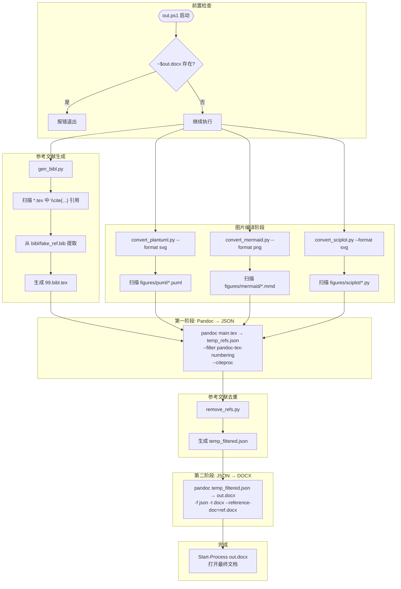
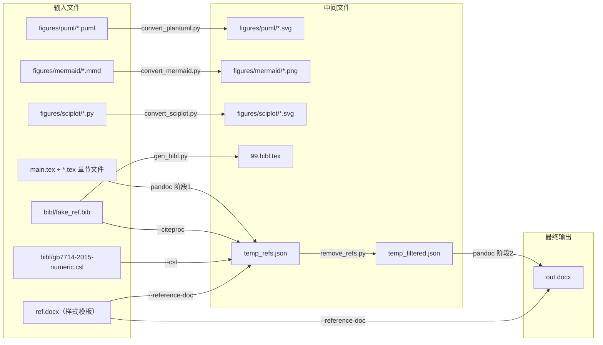

# out.ps1 控制流图

## 整体调用关系



## 文件流关系



## 执行阶段流水线

```
┌──────────────────────────────────────────────────────────────┐
│  阶段0: 前置检查                                              │
│  └─ 检查 Word 临时文件 ~$out.docx 是否存在                     │
├──────────────────────────────────────────────────────────────┤
│  阶段1: 图片编译（并行）                                       │
│  ├─ convert_plantuml.py → figures/puml/*.puml → *.svg        │
│  ├─ convert_mermaid.py  → figures/mermaid/*.mmd → *.png      │
│  └─ convert_sciplot.py  → figures/sciplot/*.py → *.svg       │
├──────────────────────────────────────────────────────────────┤
│  阶段2: 参考文献生成                                           │
│  └─ gen_bibl.py → 99.bibl.tex                                │
├──────────────────────────────────────────────────────────────┤
│  阶段3: 第一阶段 Pandoc 转换 (LaTeX → JSON)                   │
│  └─ pandoc + citeproc + pandoc-tex-numbering → temp_refs.json│
├──────────────────────────────────────────────────────────────┤
│  阶段4: 参考文献去重                                           │
│  └─ remove_refs.py → temp_filtered.json                      │
├──────────────────────────────────────────────────────────────┤
│  阶段5: 第二阶段 Pandoc 转换 (JSON → DOCX)                    │
│  └─ pandoc -f json -t docx → out.docx                        │
├──────────────────────────────────────────────────────────────┤
│  阶段6: 打开文档                                              │
│  └─ Start-Process out.docx                                   │
└──────────────────────────────────────────────────────────────┘
```

