# 补丁包控制流图

## 整体调用关系（out.ps1 → patch 链）

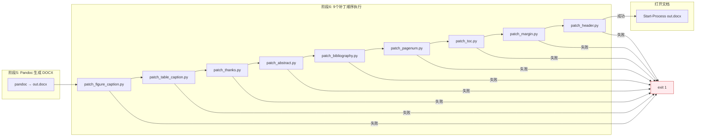

## 每个补丁的内部控制流

### 1. patch_figure_caption.py — 图片标题加粗 & 表格自适应

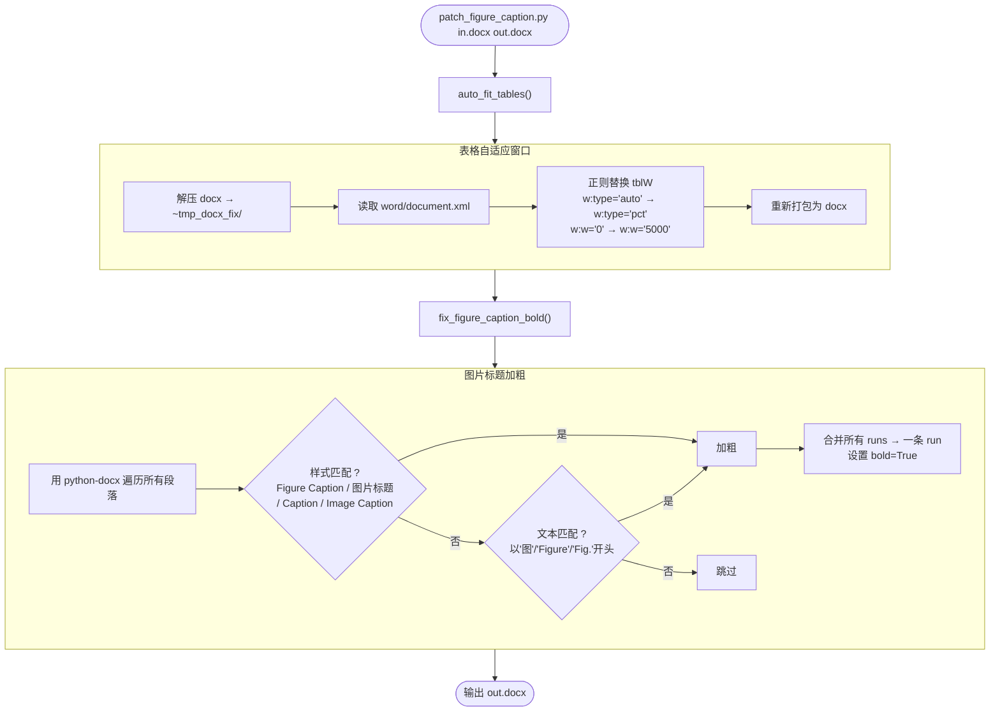

### 2. patch_table_caption.py — 表格标题加粗 & 超链接解析

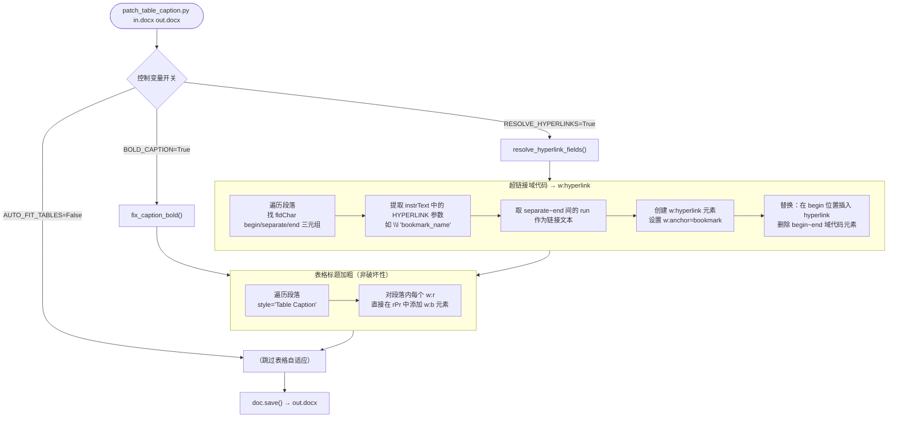

### 3. patch_thanks.py — 致谢/摘要/目录标题格式化

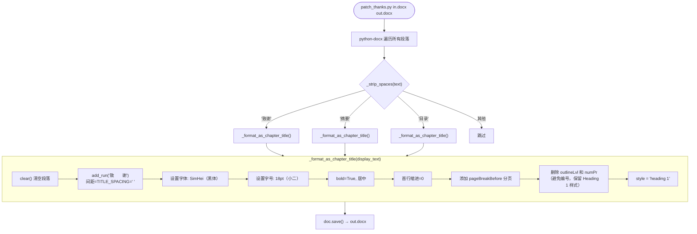

### 4. patch_abstract.py — 中英文关键词格式化

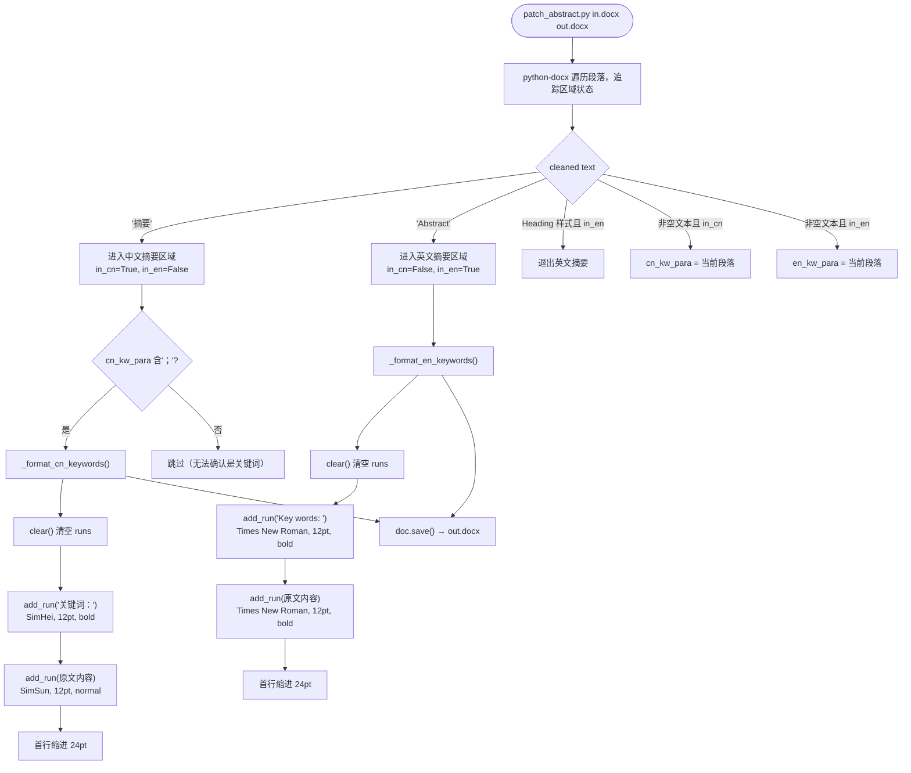

### 5. patch_bibliography.py — 参考文献编号/字体/超链接

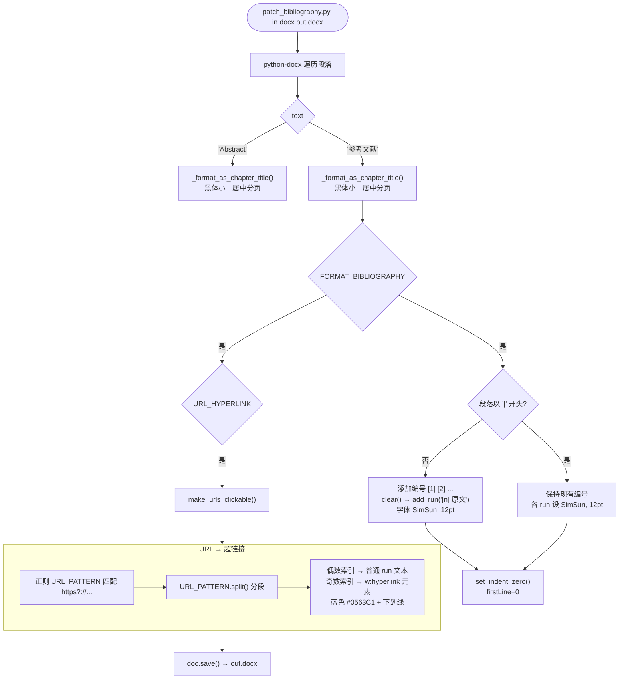

### 6. patch_pagenum.py — 复合页码（罗马/阿拉伯 + 分节页脚）

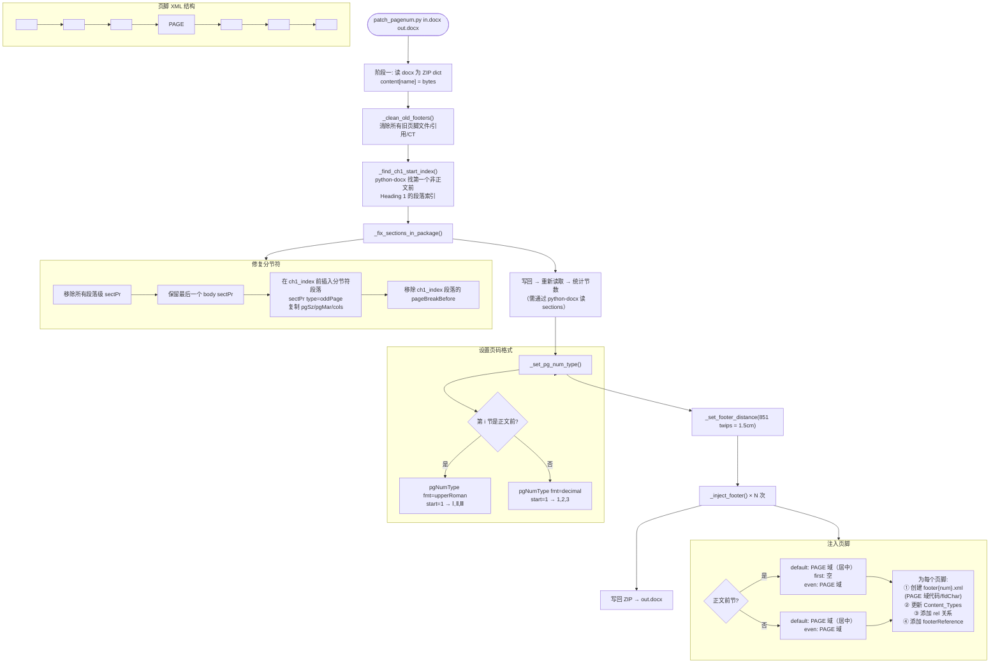

### 7. patch_toc.py — 目录生成（书签 + TOC 域 + 样式修补）

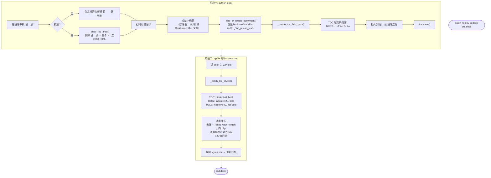

### 8. patch_margin.py — 页边距设置

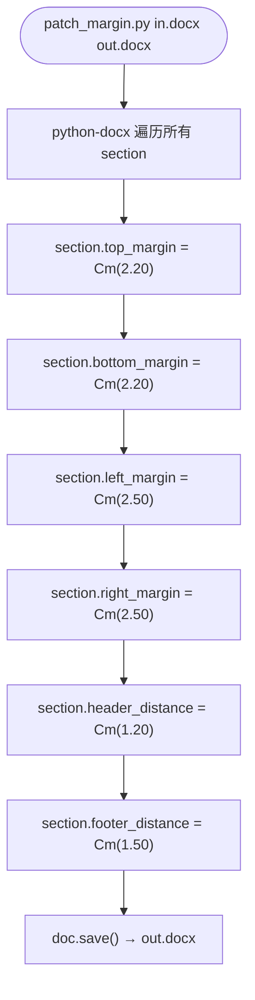

### 9. patch_header.py — 页眉文字 + LOGO

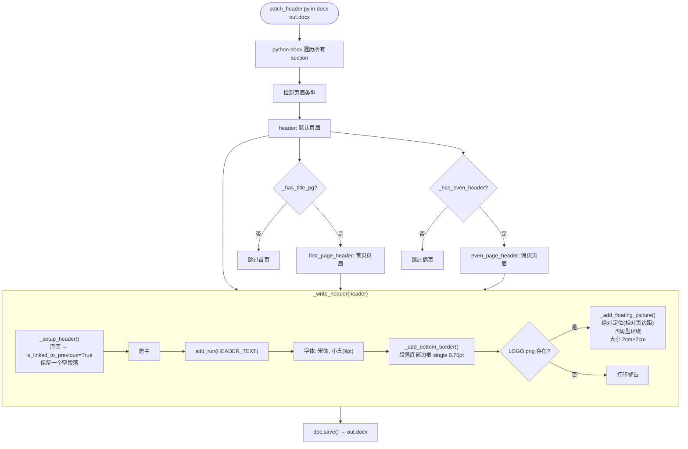

## 补丁链执行流水线

```
┌──────────────────────────────────────────────────────────────────────────┐
│ 输入: out.docx（Pandoc 生成）                                            │
├──────────────────────────────────────────────────────────────────────────┤
│  1. patch_figure_caption.py                                              │
│     ├─ auto_fit_tables()        — 表格宽度 100% 页面（解压→XML→打包）   │
│     └─ fix_figure_caption_bold()— 图片标题加粗                           │
├──────────────────────────────────────────────────────────────────────────┤
│  2. patch_table_caption.py                                               │
│     ├─ resolve_hyperlink_fields()— HYPERLINK 域→w:hyperlink              │
│     └─ fix_caption_bold()       — Table Caption 加粗（非破坏性）         │
├──────────────────────────────────────────────────────────────────────────┤
│  3. patch_thanks.py                                                     │
│     └─ 致谢/摘要/目录 → Heading 1 + 黑体小二居中分页                     │
├──────────────────────────────────────────────────────────────────────────┤
│  4. patch_abstract.py                                                   │
│     └─ 中文"关键词："黑体加粗 + 英文"Key words:" TNR 加粗               │
├──────────────────────────────────────────────────────────────────────────┤
│  5. patch_bibliography.py                                               │
│     ├─ 参考文献 → Heading 1 标题                                        │
│     ├─ 条目编号 [1][2]... + 宋体12pt + 去缩进                           │
│     └─ URL 文本 → 可点击超链接（蓝色+下划线）                           │
├──────────────────────────────────────────────────────────────────────────┤
│  6. patch_pagenum.py                                                    │
│     ├─ 清除旧页脚                                                       │
│     ├─ 修复分节符（oddPage 分节）                                       │
│     ├─ 正文前: 大写罗马数字 ⅠⅡⅢ（第1节）                               │
│     ├─ 正文: 阿拉伯数字 1 2 3（第2节起）                                │
│     └─ 注入页脚 XML（PAGE 域代码）                                      │
├──────────────────────────────────────────────────────────────────────────┤
│  7. patch_toc.py                                                        │
│     ├─ 阶段一: 扫描标题→加书签→插入TOC域代码                            │
│     └─ 阶段二: 修补 styles.xml 中 TOC1/2/3 样式                         │
├──────────────────────────────────────────────────────────────────────────┤
│  8. patch_margin.py                                                     │
│     └─ 各节: 上2.20 下2.20 左2.50 右2.50 (cm)                          │
├──────────────────────────────────────────────────────────────────────────┤
│  9. patch_header.py                                                     │
│     └─ 各节页眉: 文字(宋体小五居中) + 底部边框 + LOGO(浮动绝对定位)    │
├──────────────────────────────────────────────────────────────────────────┤
│ 输出: out.docx（最终产物，自动打开）                                     │
└──────────────────────────────────────────────────────────────────────────┘
```

## 错误处理规则

```
┌──────────────────────────────────────────────────┐
│ 每个补丁通过 $LASTEXITCODE 传递状态               │
│                                                  │
│ out.ps1 中的调用模式:                             │
│   if ($LASTEXITCODE -eq 0) {                     │
│       python patch_xxx.py ...                     │
│   }                                               │
│   if ($LASTEXITCODE -eq 0) {                     │
│       python patch_yyy.py ...                     │
│   }                                               │
│                                                  │
│ → 任一补丁返回非零退出码，后续所有补丁全部跳过     │
│ → out.docx 停留在最后一个成功补丁的状态            │
│ → 不会自动打开文档                                │
└──────────────────────────────────────────────────┘
```

## 补丁类型分类

| 类型 | 脚本 | 操作模式 |
|------|------|----------|
| XML 直接操作 | patch_figure_caption (auto_fit), patch_pagenum, patch_toc (阶段二) | 解压 ZIP → 修改 XML → 重打包 |
| python-docx 高级 API | patch_figure_caption (bold), patch_table_caption, patch_thanks, patch_abstract, patch_bibliography, patch_margin, patch_header | Document() → 遍历段落/样式 → save() |
| 混合模式 | patch_toc | 阶段一 python-docx + 阶段二 ZIP/XML |

---

# 内联函数行为分析

## python-docx 内部函数对 OOXML 结构的副作用

### 1. `clear()` / `clear_runs()` — 段落 / run 重建

用于 `patch_figure_caption`(合并)、`patch_thanks`、`patch_abstract`、`patch_bibliography`、`patch_header`。

```python
paragraph.clear()          # 删除所有 w:r 子元素，保留 w:pPr
paragraph.add_run(text)    # 新建 w:r + w:t，pPr 中原有的 run 级属性丢失
```

**副作用**：
- 原段落中的 `w:rPr`（字体、字号、颜色、超链接样式）全部丢失
- `w:r` 中的 `w:rPr` 被完全重建，仅保留新设的属性
- 对 `patch_figure_caption`：合并 run → 丢失了不同 run 的独立格式（如一个加粗词变成整段加粗）
- `patch_header` 在段落级做了 `is_linked_to_previous = True`，这会清空页眉内容

### 2. `OxmlElement` + `append()` — 原生 XML 插入

用于 `patch_table_caption`、`patch_bibliography`(URL 超链接)、`patch_pagenum`、`patch_toc`、`patch_header`。

```python
rPr = OxmlElement("w:rPr")
bold = OxmlElement("w:b")
rPr.append(bold)
r_elem.insert(0, rPr)
```

**副作用**：
- 直接操作 `lxml` 树，绕过 python-docx 的验证层
- 如果某元素已有同名子元素，会创建重复（需要手动检查是否存在再添加）
- `patch_table_caption` 的 `_bold_run_element` 内置了查重逻辑；其它脚本需自行保证

### 3. `zipfile` 直接修改 — 二进制级替换

用于 `patch_figure_caption.auto_fit_tables()`、`patch_pagenum`、`patch_toc`(阶段二)。

```python
with zipfile.ZipFile(input_path, 'r') as z:
    content = {n: z.read(n) for n in z.namelist()}
# 修改 content['word/document.xml'] 等为字节串
with zipfile.ZipFile(output_path, 'w', ZIP_DEFLATED) as z:
    for name, data in content.items():
        z.writestr(name, data)
```

**副作用**：
- `ZIP_DEFLATED` 压缩级别不同 → 文件大小可能变化
- `writestr` 按文件名排序写入 → 包内文件顺序可能改变（OOXML 规范不要求顺序，但某些旧版 Word 敏感）
- `patch_pagenum` 会写回后立即用 `_read_zip` 重读，中间状态暴露在磁盘上

### 4. `xml.etree` / `lxml.etree` 解析 — XML 树修改

用于 `patch_figure_caption.auto_fit_tables()`（xml.etree + 正则）、`patch_pagenum`（lxml）、`patch_toc` 阶段二（lxml）。

```python
# patch_figure_caption 使用正则（非解析器）
xml_content = re.sub(r'<w:tblW\s+w:type="auto"\s+w:w="0"\s*/>', ...)
# patch_pagenum 使用 lxml 完整解析
root = etree.fromstring(content['word/document.xml'])
```

**正则方式的风险**（`patch_figure_caption.auto_fit_tables`）：
- 属性顺序变化导致匹配失败：`w:w="0" w:type="auto"` → 不匹配
- 命名空间前缀变化：如果 Pandoc 用不同前缀（如 `w:` → `w10:`），正则失效
- 注释或 CDATA 干扰匹配

### 5. 幂等性（Idempotency）分析

| 脚本 | 幂等 | 原因 |
|------|------|------|
| patch_figure_caption | 否 | 第一次合并 run，第二次找不到独立 run 但不会加重（safe） |
| patch_table_caption | 是 | `_bold_run_element` 检查 `w:b` 已存在则跳过；域代码转换后不再有域元素 |
| patch_thanks | 否 | `clear()` 后第二次匹配时段落已为空文本，`_strip_spaces` 返回空 → 跳过 |
| patch_abstract | 否 | 第一次 clear 后段落内容为空，第二次 `text.strip()` 为空 → 跳过 |
| patch_bibliography | 是 | 已以 `[` 开头的段落不再加编号；URL 已替换则正则不匹配 |
| patch_pagenum | 是 | `_clean_old_footers` 先清除所有旧页脚，再重建 |
| patch_toc | 是 | `_clear_toc_area` 先清空旧目录区域，再加新书签和 TOC 域 |
| patch_margin | 是 | 每次覆盖设置边距，无状态残留 |
| patch_header | 是 | `_setup_header` 清空页眉后再写入 |

---

# 对象生命周期分析

## 单次调用内部生命周期

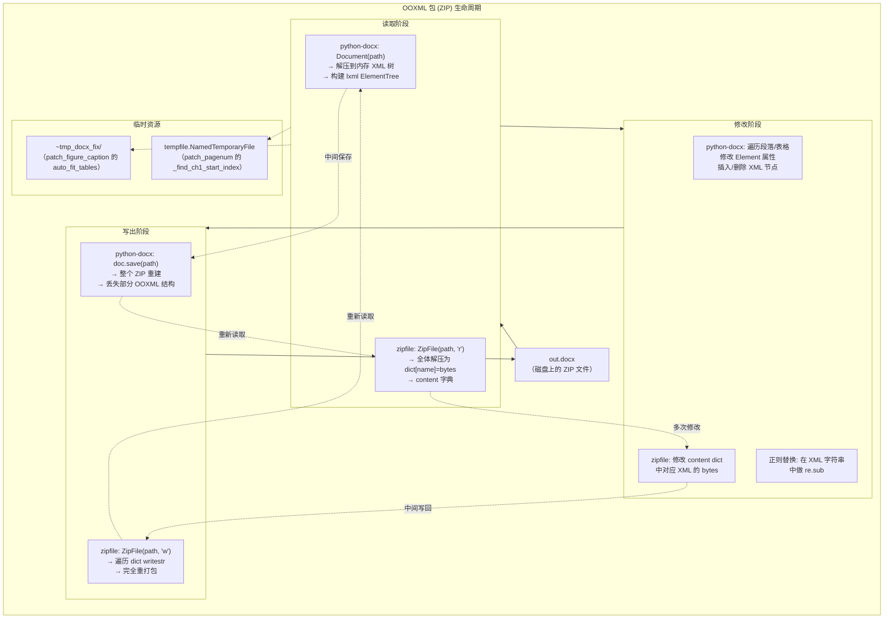

## 每补丁对象生命周期详情

### 1. patch_figure_caption — 双引擎混合

```
时间轴:
  auto_fit_tables():
    ZipFile(in, 'r')              → content dict (内存)
    regex sub on document.xml     → bytes (内存)
    ZipFile(out, 'w')             → 文件重写 (磁盘)
    shutil.rmtree(~tmp_docx_fix)  → 临时目录清理
  fix_figure_caption_bold():
    Document(out)                 → 从磁盘重读 (内存)
    iterate paragraphs → clear + add_run → 修改 (内存)
    doc.save(out)                 → 文件重写 (磁盘)
```

**生命周期计数**: 2 次完整读 + 2 次完整写，1 次临时目录创建/删除

### 2-5. patch_table_caption / patch_thanks / patch_abstract / patch_bibliography — 单引擎

```
  Document(path) → 读入 (内存)
  iterate / modify → 修改 (内存)
  doc.save(path) → 文件重写 (磁盘)
  # Document 对象超出作用域 → GC 回收
```

**生命周期计数**: 各 1 次读 + 1 次写，无临时文件

### 6. patch_pagenum — 多阶段 ZIP 引擎（最复杂）

```
阶段1:
  _read_zip(in)             → content dict (内存)
  _clean_old_footers()      → 修改 (内存)

  _fix_sections_in_package() → 修改 (内存)
  _write_zip(out)           → 文件重写 (磁盘)

阶段2:
  _read_zip(out)            → content2 dict (内存)
  Document(tmpfile)         → 临时文件 (磁盘)
  → 统计节数后删除

  _set_pg_num_type()       → 修改 (内存)
  _set_footer_distance()    → 修改 (内存)

  for N节:
    _build_footer_xml()     → 创建 XML ElementTree (内存)
    _inject_footer()        → 修改 content → 更新 CT/rels (内存)

  _write_zip(out)           → 文件重写 (磁盘)
```

**生命周期计数**: 2 次 zipfile 读 + 2 次 zipfile 写，额外 python-docx 临时文件

**关键中间状态**: 阶段1写回后，out.docx 处于"无页脚"状态约几十毫秒，才被阶段2补回。

### 7. patch_toc — 双阶段串行引擎

```
阶段一 (python-docx):
  Document(path) → 读入 (内存)
  找"目录" → 清除旧条目 → 加书签 → 插入 TOC 域 (内存)
  doc.save() → 文件重写 (磁盘)

阶段二 (zipfile):
  ZipFile(path, 'r') → content dict (内存)
  _patch_toc_styles() → 修改 styles.xml (内存)
  ZipFile(temp_out, 'w') → 写入临时文件 (磁盘)
  os.replace(temp_out, path) → 原子替换 (磁盘)
```

**生命周期计数**: 2 次读 + 2 次写，使用临时文件 + 原子替换

### 8-9. patch_margin / patch_header — 单引擎，同 2-5

## 跨补丁链文档状态变化

```mermaid
flowchart LR
    subgraph S0["初始"]
        DOC0["out.docx\nPandoc 生成"]
    end

    subgraph S1["patch_figure_caption"]
        NOTE1["tblW: auto→pct\n图片标题 run 合并"]
    end

    subgraph S2["patch_table_caption"]
        NOTE2["域→hyperlink\nTable Caption 加粗"]
    end

    subgraph S3["patch_thanks"]
        NOTE3["致谢/摘要/目录\n→ Heading 1"]
    end

    subgraph S4["patch_abstract"]
        NOTE4["关键词格式化"]
    end

    subgraph S5["patch_bibliography"]
        NOTE5["参考文献\n编号+字体+URL"]
    end

    subgraph S6["patch_pagenum"]
        NOTE6["分节符重写\n页脚注入\n页码格式"]
    end

    subgraph S7["patch_toc"]
        NOTE7["书签+TOC域\nTOC样式修补"]
    end

    subgraph S8["patch_margin"]
        NOTE8["页边距 2.20/2.20/2.50/2.50"]
    end

    subgraph S9["patch_header"]
        NOTE9["页眉+底部边框+LOGO"]
    end

    DOC0 -->|"读→写"| S1
    S1 -->|"重读→重写"| S2
    S2 -->|"重读→重写"| S3
    S3 -->|"重读→重写"| S4
    S4 -->|"重读→重写"| S5
    S5 -->|"重读→重写"| S6
    S6 -->|"重读→重写"| S7
    S7 -->|"重读→重写"| S8
    S8 -->|"重读→重写"| S9
```

## 累计读写放大

整个补丁链对 `out.docx` 的读写统计：

| 补丁 | 读次数 | 写次数 | 读方式 | 写方式 | 临时文件 |
|------|--------|--------|--------|--------|----------|
| patch_figure_caption | 2 | 2 | Document + zipfile | save + zipfile | ~tmp_docx_fix/ |
| patch_table_caption | 1 | 1 | Document | save | 无 |
| patch_thanks | 1 | 1 | Document | save | 无 |
| patch_abstract | 1 | 1 | Document | save | 无 |
| patch_bibliography | 1 | 1 | Document | save | 无 |
| patch_pagenum | 2 | 2 | zipfile ×2 + Document(tmp) | zipfile ×2 | NamedTemporaryFile |
| patch_toc | 2 | 2 | Document + zipfile | save + zipfile | *.tmp 临时文件 |
| patch_margin | 1 | 1 | Document | save | 无 |
| patch_header | 1 | 1 | Document | save | 无 |
| **合计** | **12** | **12** | — | — | **3** |

- 文件被完整读入内存 12 次，完整写回磁盘 12 次
- 每次 `doc.save()` 都会重建整个 ZIP，丢失原始 OOXML 的某些非标准结构
- 如果 out.docx 约 5MB，链总 I/O 约 12 × 5MB = 60MB 读取 + 60MB 写入

## 内存泄漏风险

| 风险点 | 说明 | 涉及脚本 |
|--------|------|----------|
| `content = {n: z.read(n) for n in z.namelist()}` | 整个 docx 解压到 dict，小文件无问题，大文件（含嵌入图片）会高内存 | patch_pagenum, patch_toc |
| `~tmp_docx_fix/` 不清理 | `finally` 块保证清理，但异常中断时目录残留 | patch_figure_caption |
| `NamedTemporaryFile(delete=False)` | 需手动 `os.unlink`，已实现 | patch_pagenum |
| Document 对象延迟 GC | python-docx 中 Document 持有整个 XML 树直到 GC | 所有使用 Document 的脚本 |
| lxml ElementTree 循环引用 | lxml 的 C 层面引用回收依赖 GC 运行时机 | patch_pagenum, patch_toc |

## 对象生命周期图例

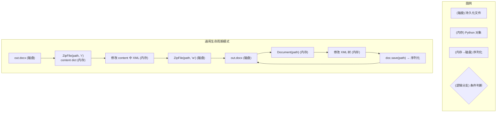

## 跨补丁格式传递依赖

```
patch_figure_caption (合并 run)
       ↓ 丢失 run 级格式差异
patch_table_caption (非破坏性加粗 w:b)
       ↓ w:b 追加到 rPr 尾部
patch_thanks (清空段落重建)
       ↓ Heading 1 + pageBreakBefore
patch_abstract (清空 runs 重建)
       ↓ 仅影响关键词段落
patch_bibliography (清空段落重建)
       ↓ 仅影响参考文献段
patch_pagenum (zipfile 直接操作)
       ↓ lxml 解析 → 修改 → 序列化
       ↓ 破坏 python-docx 在 document.xml 中
         注入的额外命名空间声明
patch_toc -> python-docx 阶段一
       ↓ 受 pagenum 修改后的 XML 影响
patch_toc -> zipfile 阶段二
       ↓ 完全避开 python-docx 层
patch_margin (python-docx section API)
       ↓ 依赖 pagenum 建立的分节结构
patch_header (python-docx section API)
       ↓ 依赖 pagenum 建立的分节结构
```

**关键传递依赖**：
- `patch_margin` 和 `patch_header` **依赖** `patch_pagenum` 建立的分节符结构（`_fix_sections_in_package` 在第一个 H1 前插入 `sectPr type=oddPage`）
- `patch_pagenum` 的 lxml 重序列化可能会改变 document.xml 的命名空间声明，影响 python-docx 后续解析
- python-docx 的 `doc.save()` 会按自己的逻辑重新组织 XML，zipfile 模式则保留原始 XML 结构

## 各补丁

| 补丁 | 主要操作对象 | 对象类型 | 生命周期范围 | 持有时间 |
|------|-------------|----------|-------------|----------|
| patch_figure_caption | Document, ZipFile, tmp_dir | 混合 | 函数级 | auto_fit 期间 |
| patch_table_caption | Document | python-docx | process_document() | 完整调用 |
| patch_thanks | Document | python-docx | patch_thanks() | 完整调用 |
| patch_abstract | Document | python-docx | patch_abstract() | 完整调用 |
| patch_bibliography | Document | python-docx | patch_bibliography() | 完整调用 |
| patch_pagenum | content dict, lxml trees, tmp Document | zipfile + lxml | add_page_numbers() | 完整调用 |
| patch_toc | Document, content dict | 混合 | add_toc() 分两阶段 | 分阶段 |
| patch_margin | Document | python-docx | set_margins() | 完整调用 |
| patch_header | Document | python-docx | add_header() | 完整调用 |

| 脚本 | 读方式 | 写方式 | 破坏性 |
|------|--------|--------|--------|
| patch_figure_caption | Document() + zipfile | save() + zipfile | 合并 run（破坏 run 结构） |
| patch_table_caption | Document() | save() | 非破坏性（直接加 w:b） |
| patch_thanks | Document() | save() | clear() 清空段落 |
| patch_abstract | Document() | save() | clear() 清空 runs |
| patch_bibliography | Document() | save() | clear() 清空段落 |
| patch_pagenum | zipfile | zipfile | 重写页脚/分节结构 |
| patch_toc | Document() + zipfile | save() + zipfile | 插入/删除段落 |
| patch_margin | Document() | save() | 非破坏性（改属性） |
| patch_header | Document() | save() | clear() 清空段落 |
